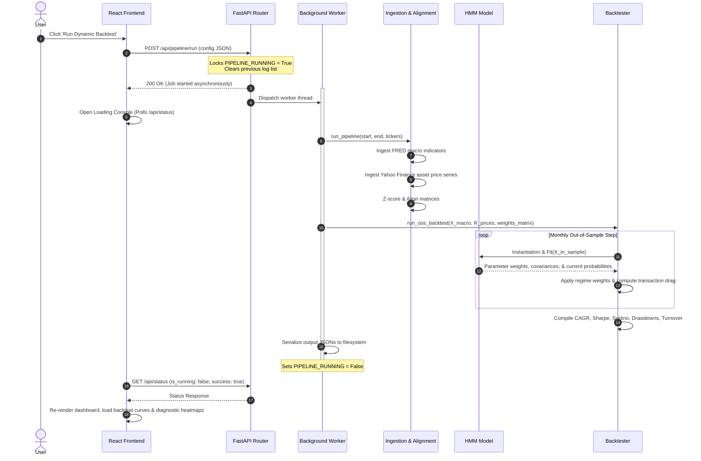

# Stratos Macro Allocation Suite: System Architecture & Data Flow

This document details the software architecture, modular breakdown, and end-to-end data flow of the **Stratos Macro Allocation Suite**.

---

## 1. High-Level Architectural Pattern

Stratos is built on a **decoupled client-server model** optimized for local execution as well as cloud deployment (e.g., Vercel + serverless environments).

* **Backend (FastAPI)**: Serves as a high-performance quantitative calculation engine. It handles data ingestion, model fitting (HMM), walk-forward backtest simulations, and metric compilation. It operates in a stateless manner but supports state caching via the local filesystem or temporary directories.
* **Frontend (React + Vite)**: A responsive single-page dashboard designed with a dark, high-contrast visual theme. It communicates with the backend via asynchronous JSON endpoints and handles real-time stream processing for pipeline progress tracking.

```
┌────────────────────────────────────────────────────────┐
│                   Vite + React Client                  │
└───────────┬────────────────────────────▲───────────────┘
            │ HTTP Trigger               │ Dynamic JSON API
            ▼                            │
┌────────────────────────────────────────┴───────────────┐
│                    FastAPI Server                      │
│  ┌──────────────────┐            ┌──────────────────┐  │
│  │   API Handlers   │            │   Log intercept  │  │
│  └────────┬─────────┘            └────────▲─────────┘  │
│           │ Dispatch                      │ Captures   │
│           ▼                               │ stdout     │
│  ┌──────────────────┐            ┌────────┴─────────┐  │
│  │ Background Worker│───────────►│  LogStream pipe  │  │
│  └────────┬─────────┘            └──────────────────┘  │
│           │ Computes                                   │
│           ▼                                            │
│  ┌──────────────────────────────────────────────────┐  │
│  │                 Core Pipeline                    │  │
│  │  - Data Fetching (FRED, Yahoo Finance)            │  │
│  │  - Gaussian HMM Training                         │  │
│  │  - Walk-Forward Backtester                       │  │
│  └──────────────────────────────────────────────────┘  │
└────────────────────────────────────────────────────────┘
```

---

## 2. Component & Module Breakdown

### 2.1. Backend Module Architecture
The backend is structured into domain-specific modules under `backend/src`:

1. **API Router ([backend/api/index.py](file:///g:/Macro-Regime-Detection/backend/api/index.py))**:
   Exposes the REST API endpoints. It manages pipeline execution in background threads to prevent HTTP timeouts, tracks engine state, and records error tracebacks.
2. **Data Ingestion ([backend/src/pipeline.py](file:///g:/Macro-Regime-Detection/backend/src/pipeline.py))**:
   Contains logic to concurrently request, align, clean, and standardize economic variables (FRED API) and price series (Yahoo Finance API).
3. **Hidden Markov Model ([backend/src/models/custom_hmm.py](file:///g:/Macro-Regime-Detection/backend/src/models/custom_hmm.py))**:
   Encapsulates the custom Expectation-Maximization Gaussian HMM. It has no external C-dependencies, ensuring portability.
4. **Walk-Forward Simulator ([backend/src/backtest/backtester.py](file:///g:/Macro-Regime-Detection/backend/src/backtest/backtester.py))**:
   Iteratively moves time windows, trains HMM instances, aggregates out-of-sample blended allocations, computes trading transaction drag, and outputs cumulative performance series.
5. **Asset Allocator ([backend/src/allocation/regime_allocator.py](file:///g:/Macro-Regime-Detection/backend/src/allocation/regime_allocator.py))**:
   Combines the user-defined allocation matrix with the inferred state probabilities to compute target weights for the portfolio.

---

## 3. Data Flow Execution Sequence

When a user adjusts their time horizon, selects assets, sets regime-conditional target weights, and clicks **Run Dynamic Backtest**, the system executes the following steps:



---

## 4. Key Architectural Integrations

### 4.1. Thread-Safe Log Interception & Streaming
To allow users to inspect the pipeline execution, Stratos features a custom **Stdout Interceptor** in [index.py](file:///g:/Macro-Regime-Detection/backend/api/index.py):
* A thread-safe, custom `StringIO` buffer (`LogStream`) intercepts all `print` statements generated inside `pipeline.py` and `backtester.py`.
* Logs are enriched with source tags (e.g. `[FRED]`, `[YAHOO]`, `[MODEL]`, `[BACKTEST]`) and saved.
* The React frontend polls `/api/status` every 1000ms during compilation, streaming these logs into a custom dark console overlay. It parses labels and colors them (e.g., gold for Yahoo Finance, blue for FRED, green for successes) while auto-scrolling to keep the user informed.

### 2. Performance-Driven Code Splitting
To optimize load times, the frontend uses **React.lazy** dynamic imports in [App.jsx](file:///g:/Macro-Regime-Detection/frontend/src/App.jsx#L4-L7):
* Dashboard, backtesting, and model diagnostics are separated into individual chunks.
* The main landing package is light ($\approx 156\text{ kB}$), loading in milliseconds, while heavier charting elements (such as `Recharts` modules) are loaded dynamically inside `<Suspense>` layers when tabs are active.
